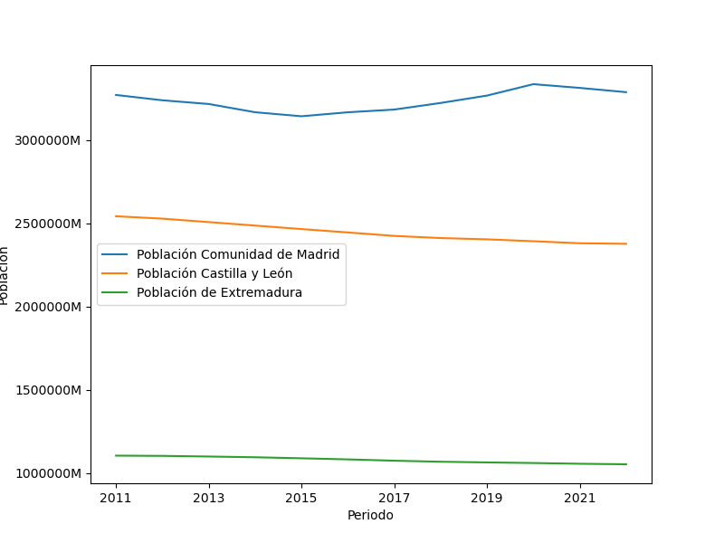
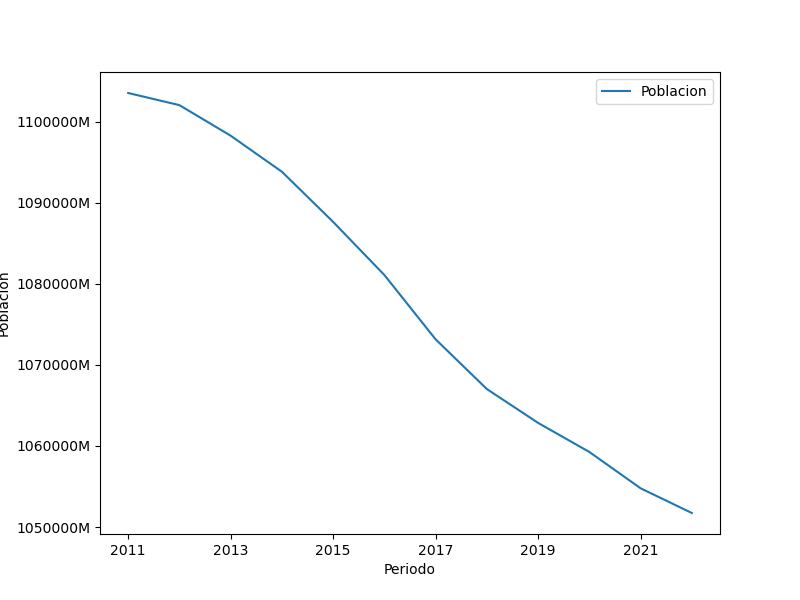
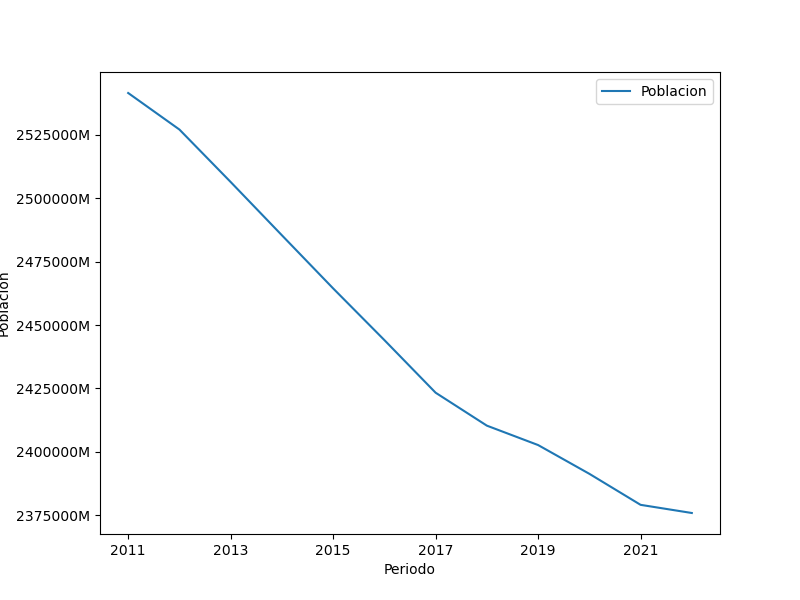
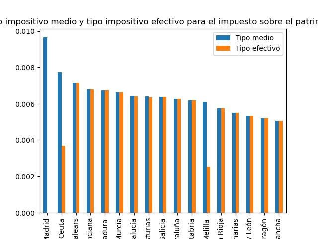
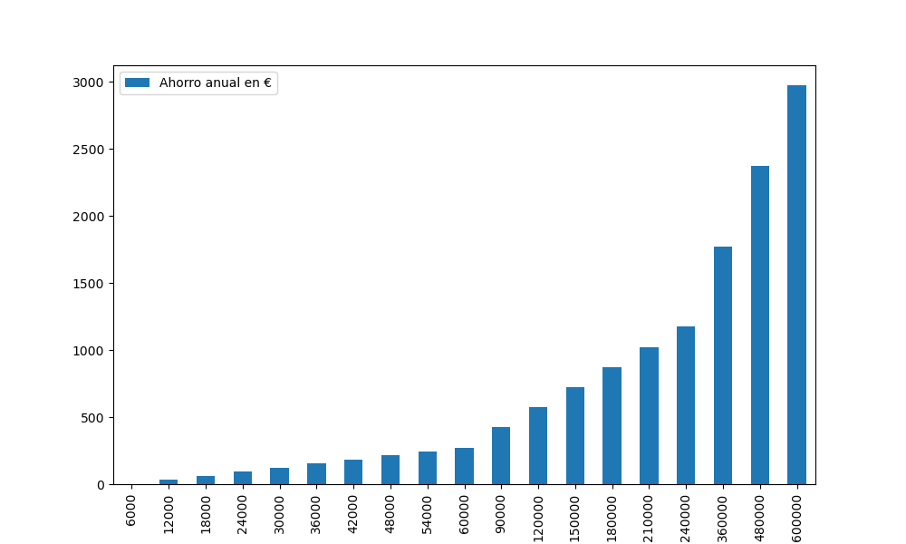

# Proyecto 4

# 1º Parte: extracción, transformación y carga.

  

 
### Objetivo: implementar el proceso de extracción, transformación y carga de datos, poniendo en práctica las habilidades adquiridas hasta ahora. 
### Partiendo de esta base, he decido recabar información que relacione de alguna forma la agudización del despoblamiento de algunas regiones de lo que se conoce como "España vaciada" y la bajada de carga impositiva a las rentas altas por parte de la Comunidad de Madrid, una práctica desleal señalada como "dumping fiscal". 
### Soy consciente de que llevar a cabo un estudio de este tipo puede parecer pretencioso teniendo en cuenta las limitaciones en cuanto a tiempo y sobretodo en cuanto a habilidades y experiencia en este campo, pero mi objetivo no es tanto el rigor, si no utilizar este somero análisis como hilo conductor para el recabo y transformación de información.

## 1-Extracción:

#### - Utilizando la técnica de scraping a través de la librería Selenium de Python, he extraído una tabla alojada en https://datawrapper.dwcdn.net/LG7ud/3/ en la cual se encuentran datos sobre el IRPF en la Comunidad de Madrid.
#### - A través del sitio web del ministerio de Hacienda he obtenido una tabla con datos sobre tipos impositivos para el impuesto del patrimonio por Comunidades Autónomas. https://www.hacienda.gob.es/Documentacion/Publico/Tributos/Estadisticas/IP/2020/Graficos-Libro-IP-2020.zip
#### - En la página https://portalestadistico.com/municipioencifras/proceso_descarga_excel_csv.aspx he conseguido una tabla con la evolución de la población de la Comunidad de Madrid
#### - Por último, los datos de evolución de población de las comunidades de Extremadura y Castilla y León las he descargado de: https://www.epdata.es/evolucion-poblacion/4d9f26fa-ff32-4aad-bf83-7d03c79062ee/castilla-leon/295

## 2-Transformación:

  

### - Una vez cargadas las tablas en Jupyter Notebook procedo a su transformación, el proceso ha sido muy similar para las cuatro tablas y podría resumirlo en los siguientes puntos:

1. Exploración y visualización del dataframe mediante los métodos .head(), .info(), .describe(), .columns; a fin de encontrar nulos, comprobar los nombres de las columnas, encontrar redundancias.
2. Eliminar nulos, columnas redundantes, crear nuevas columnas en caso de que el dataframe solo tenga una columna en la que se encuentran todos los valores, limpiar columnas de valores no numéricos para poder convertirlos en int o float.
3. Seleccionar las columnas que contengan los datos que necesito para mi propósito.

- Así venía la tabla obtenida en portalestadístico.com:
  

- Y así queda después de su transformación

## 3-Carga:
Esta es la última fase del proceso en la cual los datos transformados son cargados en el sistema de destino, por su facilidad de uso he elegido MongoDB, que es una base de datos NoSQL orientada a documentos y que no requiere un esquema fijo.

# 2º Parte: Dumping fiscal en la Comunidad de Madrid y vaciamiento de la España interior.

### El fenómeno del desplazamiento de población de zonas de la España central hacia Madrid y la consecuente despoblación de estas es un fenómeno complejo y multicausal. No pretendo demostrar que exista una relación directa entre el dumping fiscal que realiza Comunidad de Madrid y la España vaciada, pero sí que contribuye a agravar el problema de la despoblación atrayendo a empresas y personas a esta región en detrimento de otras zonas de España.

  

-Evolución de la población de Extremadura

  

-Evolución de la población de Castilla y León

  

   

-Tipo impositivo medio y efectivo del impuesto sobre el patrimonio.
* El tipo medio se refiere al porcentaje que resulta de dividir la cuota tributaria por la base imponible, mientras que el tipo efectivo se refiere al porcentaje real que una persona física o jurídica paga a la Hacienda Pública.

  

### La siguiente gráfica representa el ahorro anual en función de la base liquidable después de la reforma del IRPF en la Comunidad de Madrid. Se aprecia claramente la falta de progesividad y como una renta de 600.000€ ahorraría 3000€ al año mientras el ahorro de una de 12.000 estaría en torno a los 33€ al año. El problema no es tanto ese "ahorro" si no lo que las grandes fortunas dejan de pagar.

