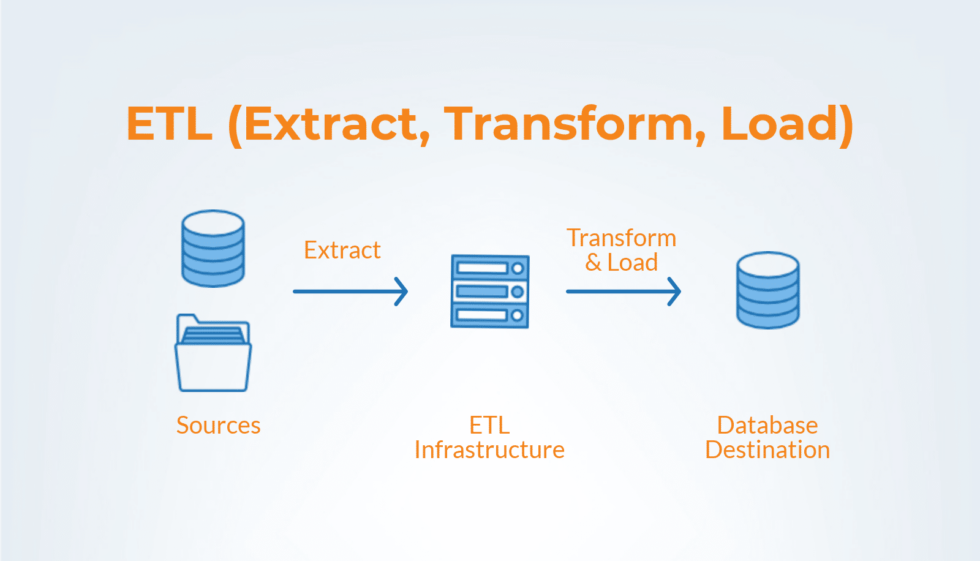

# Proyecto 4: extracción, transformación y carga.

  

 
### Objetivo: implementar el proceso de extracción, transformación y carga de datos, poniendo en práctica las habilidades adquiridas hasta ahora. 
### Partiendo de esta base, he decido recabar información que relacione de alguna forma la agudización del despoblamiento de algunas regiones de lo que se conoce como "España vaciada" y la bajada de carga impositiva a las rentas altas, una práctica desleal señalada como "dumping fiscal", por parte de la Comunidad de Madrid. 
### Soy consciente de que llevar a cabo un estudio de este tipo puede parecer pretencioso teniendo en cuenta las limitaciones en cuanto a tiempo y sobretodo en cuanto a habilidades y experiencia en este campo, pero el objetivo no es tanto el rigor, si no utilizar este somero análisis como hilo conductor para el recabo y transformación de información.

## 1-Extracción:

### - Utilizando la técnica de scraping a través de la librería Selenium de Python, he extraído una tabla alojada en https://datawrapper.dwcdn.net/LG7ud/3/ en la cual se encuentran datos sobre el IRPF en la Comunidad de Madrid.
### - A través del sitio web del ministerio de Hacienda he obtenido una tabla con datos sobre tipos impositivos para el impuesto del patrimonio por Comunidades Autónomas. https://www.hacienda.gob.es/Documentacion/Publico/Tributos/Estadisticas/IP/2020/Graficos-Libro-IP-2020.zip
### - En la página https://portalestadistico.com/municipioencifras/proceso_descarga_excel_csv.aspx he conseguido una tabla con la evolución de la población de la Comunidad de Madrid
### - Por último, los datos de evolución de población de las comunidades de Extremadura y Castilla y León las he descargado de: https://www.epdata.es/evolucion-poblacion/4d9f26fa-ff32-4aad-bf83-7d03c79062ee/castilla-leon/295
